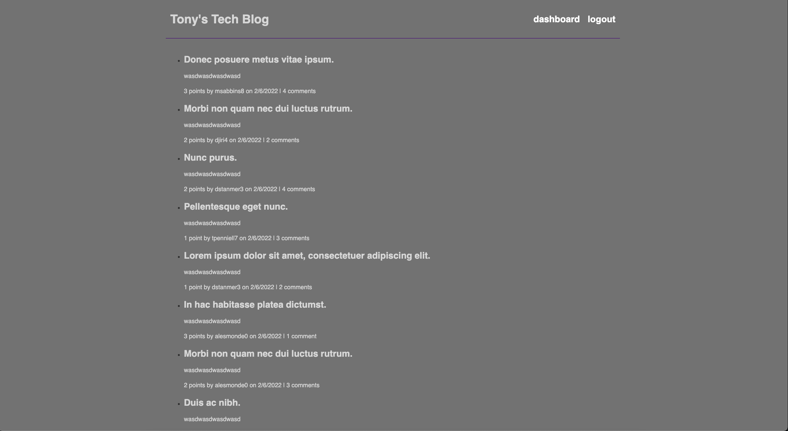
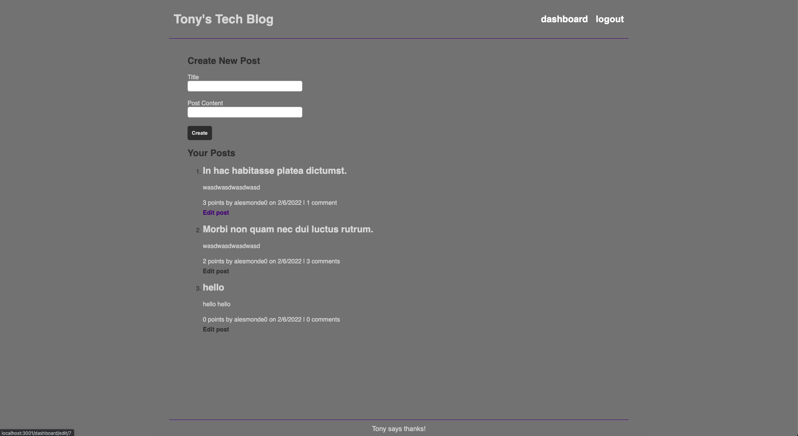

# Tony's Tech Blog

## Description

Tony's Tech Blog is a blog app where users can come and make posts about new tech news or old tech they find interesting.  The page has features for edits, deletes, comments and votes.  It is also a good base to start other projects off of.  This app is also deployed to heroku.

## Table of Contents

* [Installation](#installation)
* [Usage](#usage)
* [Screenshots](#screenshots)
* [Deployment](#deployment)
* [Questions](#questions)

## Installation

To install clone the GitHub repo.  Run npm install in the command line to get the dependencies.  Go into your mysql shell and run source db/schema.sql to setup the database.  Then setup a .env file as the example is shown.  Then you can run npm run seed in the command line to seed some data.  Finally you can run npm start in the command line to run the app on your local 3001 server.  

## Usage

Once you install of the app is complete you can go into broswer to localhost:3001 and usse the app.  First start by clicking login in where you can create a account with just a username and password. From there all the features of the app are open to create posts, delete posts, edit posts, comment on posts and vote on posts.

## Screenshots

## Deployment

https://blooming-cliffs-21100.herokuapp.com/

## Questions

If you have any questions please reach out to me on GitHub at [https://github.com/Emccar22](https://github.com/Emccar22) or Email me at [e.mccarthy2285@gmail.com](mailto:e.mccarthy2285@gmail.com)
